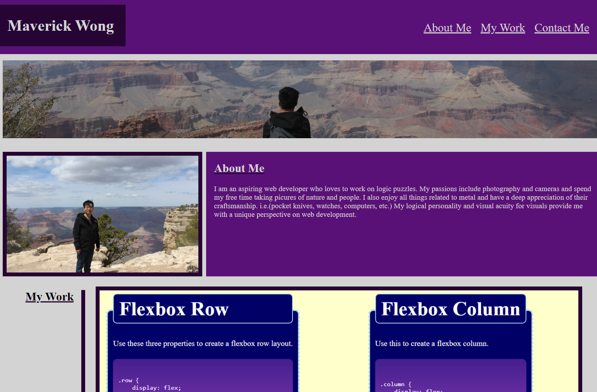

# portfolio-page

## Description 

This is a portfolio of me. It gives you an overview of me as a person and of my work.
This will continue to be updated as I undertake more projects and have a deeper understanding of web developement in general. There are some bugs I was unable to resolve in the CSS stylesheet.

[Deployed Website](##)

## Usage 

To provide an Overview Portfolio of me and my work. See screenshot and deployed site.

## Credits

[w3 Schools](https://www.w3schools.com/)
[CSS-Tricks](https://css-tricks.com/snippets/css/a-guide-to-flexbox/)

## License

MIT License